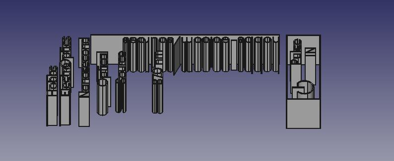

## Goals
+ Make a label in inkscape or any other SVG exporting program
+ Export the label as paths only (no fonts)
+ Import into FreeCAD
+ Turn the label into objects that can be placed on an objects surface to mark a label

## Background
We can do this in the GUI:

1. File->import filename.svg
2. Open SVG as geometry
3. Turn each path into a sketch
4. Make a new body for each sketch
5. Extrude each sketch
6. Group into a part

If we are doing a label this is a great deal of duplicated effort.

## Approach

### File Preparation
+ Turn all strokes and fonts to paths
+ Split all separate paths (such as lowercase i)
+ Join intersecting paths using combine
+ The inkscape label to paths is describe [here](https://gist.github.com/snhobbs/85aaf8b2750a3a163d3579257b71d124)

### Algorithm
+ Cycle through all parts, find the ones that are completely within another and XOR them
+ For non-intersecting paths use the draft->upgrade tool
+ Make each into their own body and extrude
+ Join the objects using a boolean XOR. This will keep the positively extruded parts and subtract the negative extrusion.

## Workflow
+ Use OpenSCAD to define the outline of the label
+ Export to SVG and open with inkscape
+ Design Label
+ Run make file which exports the different versions ([source here](https://gist.github.com/snhobbs/85aaf8b2750a3a163d3579257b71d124))
+ Fix intersection in paths (select intersecting parts -> union) and seperate paths like is (ctrl-a + "split paths" works)
+ Select strokes and turn them into paths (ctrl+a + "stroke to path")
+ Run freecad transformation script
+ Open the freecad document and export the part group to a step file. If the paths are connected in a single step body the cut fails; they must be grouped as parts.
+ Export the parts to a step file
+ Embed or cut into object

| Inkscape Label Design |
|---|
|  |

| Extruded label as FreeCAD Parts |
|---|
||

| Extruded Part on Target (bottom label also shown) |
|---|
||

| Final label on target with cutout section. |
|---|
||

## Resources
+ <https://wiki.freecad.org/Import_text_and_geometry_from_Inkscape/en>
+ <https://www.youtube.com/watch?v=L-jqKb0f-78&ab_channel=61quick>

